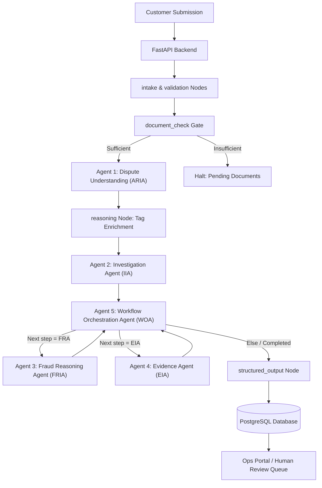

# Intelligent Transaction Dispute Resolution Platform

An enterprise-grade, multi-agent BFSI (Banking, Financial Services, and Insurance) transaction dispute resolution platform. The platform automates transaction intake, user identity and trust profiling, dispute classification, automated evidence validation, structured investigation planning, and workflow orchestration.

Backed by **FastAPI**, **LangGraph**, **Groq (Llama 3.1)**, **PostgreSQL (SQLAlchemy)**, and a **Next.js 14 (App Router)** frontend.

---

## ── Multi-Agent Architecture Overview ──

The system comprises **5 specialized, cooperative agents** that execute in a compiled LangGraph workflow to evaluate, classify, investigate, and route case resolutions. The agents execute in the following sequence:



### 1. Agent 1: Dispute Understanding Agent (ARIA)
* **Code Registry**: [dispute_agent](file:///d:/Transaction_dispute_agent/ai-dispute-resolution-system/backend/agents/dispute_agent)
* **Purpose**: Analyzes the claim details and uploaded documents (extracted via OCR) to categorize the dispute, assess fraud suspicion, extract customer intent, and evaluate initial document corroboration.
* **Understanding Tools (in-memory computation)**:
  - `assess_transaction_context`: Evaluates transaction value tiers (RBI circular 2017 thresholds), off-hours risk, card-not-present (CNP) channels, and international patterns.
  - `score_fraud_indicators`: Tallies active fraud patterns (OTP sharing, remote access, phishing links, card/device loss).
  - `verify_evidence_match`: Verifies if OCR texts corroborate merchant name and claimed amounts.
  - `compute_confidence_score`: Calculates final classification certainty score (0.10 to 1.00).
* **Key Outputs**:
  - `dispute_category` (One of 9 canonical BFSI categories, e.g., `Unauthorized Transaction`, `Duplicate Transaction`, `Refund Not Received`)
  - `fraud_suspicion` (Boolean flag)
  - `priority` (`CRITICAL` | `HIGH` | `MEDIUM` | `LOW`)
  - `confidence_score` (Float `0.10` to `1.00`)
  - `risk_tags` (e.g., `VELOCITY_BREACH`, `POSSIBLE_FRAUD`, `CARD_NOT_PRESENT`)

### 2. Agent 2: Investigation Intelligence Agent (IIA)
* **Code Registry**: [investigation_agent](file:///d:/Transaction_dispute_agent/ai-dispute-resolution-system/backend/agents/investigation_agent)
* **Purpose**: Pre-runs database-backed historical intelligence checks on the customer, merchant, and duplicate cases, then designs a structured investigation plan tailored to the category and risk signals.
* **Database-Backed Tools**:
  - `lookup_customer_history`: Examines historical dispute volume, chargeback ratios, and frequency trends.
  - `check_merchant_risk`: Resolves merchant category risk profiles, chargeback ratios, and complaints.
  - `find_duplicate_transaction`: Audits active disputes for identical merchant/amount/date overlaps within a 72-hour window.
  - `lookup_related_cases`: Resolves historical case outcomes for similar dispute types.
* **Key Outputs**:
  - `recommended_queue` (`CRITICAL_QUEUE` | `FRAUD_QUEUE` | `HIGH_VALUE_QUEUE` | `MERCHANT_QUEUE` | `ATM_QUEUE` | `STANDARD_QUEUE`)
  - `investigation_complexity` (`LOW` | `MEDIUM` | `HIGH` | `CRITICAL`)
  - `required_documents` (list of outstanding customer evidence needed)
  - `recommended_steps` (ordered resolution plan checklist for ops analysts)
  - `investigation_summary` (comprehensive plan outline)

### 3. Agent 3: Fraud Reasoning Agent (FRIA)
* **Code Registry**: [fraud_reasoning_agent](file:///d:/Transaction_dispute_agent/ai-dispute-resolution-system/backend/agents/fraud_reasoning_agent)
* **Purpose**: Audits transaction parameters for security risk anomalies. Validates geographical travel velocity, z-score spending deviations, customer identity/KYC records, device fingerprints, and prior friendly fraud tendencies.
* **Database-Backed Tools**:
  - `detect_transaction_anomalies`: Analyzes transaction off-hours flags and short-term transaction velocity.
  - `evaluate_location_velocity`: Scans historical transactions to check for geovelocity deviations (impossible travel distance under 4 hours).
  - `analyze_spending_behavior`: Computes statistical deviation (Z-score) of the transaction amount.
  - `verify_kyc_match`: Compares dispute details againstCore Customer CIF records.
  - `evaluate_device_fingerprint`: Audits login logs to check device ID familiarity and location consistency.
  - `analyze_behavioral_patterns`: Scans customer dispute ratios and resolution profiles to calculate friendly fraud indicators.
* **Key Outputs**:
  - `fraud_probability` (Float `0.0` to `1.0` - probability of active fraud)
  - `fraud_risk_level` (`LOW` | `MEDIUM` | `HIGH` | `CRITICAL`)
  - `user_trust_score` (Float `0.0` to `1.0` - user trust calibration)
  - `behavioral_risk_score` (Float `0.0` to `1.0`)
  - `identity_verification` (`VERIFIED` | `SUSPICIOUS` | `FAILED`)

### 4. Agent 4: Evidence Intelligence Agent (EIA)
* **Code Registry**: [evidence_agent](file:///d:/Transaction_dispute_agent/ai-dispute-resolution-system/backend/agents/evidence_agent)
* **Purpose**: Audits evidence completeness and transaction consistency across customer-submitted files vs bank-obtainable logs. Recommends document request actions if missing evidence blocks the investigation.
* **Database-Backed Tools**:
  - `evaluate_evidence_completeness`: Computes completeness percentage against customer-obtainable documents.
  - `identify_missing_evidence`: Checks unfulfilled document requests and checks if gaps block investigation.
  - `validate_evidence_consistency`: Cross-checks amount, merchant, and dates against original transaction records.
  - `assess_evidence_strength`: Weighs completeness, AI verdicts, and data quality (HIGH, MEDIUM, LOW).
  - `determine_next_document_request`: Dynamically recommends the next document type to formally request from the customer.
* **Key Outputs**:
  - `evidence_completeness` (Integer 0-100)
  - `evidence_strength` (`HIGH` | `MEDIUM` | `LOW`)
  - `evidence_consistent` (Boolean)
  - `missing_documents` (List of required documents not yet submitted)
  - `recommended_document_requests` (List of outstanding document types to request)
  - `investigation_blocked` (Boolean)

### 5. Agent 5: Workflow Orchestration Agent (WOA)
* **Code Registry**: [orchestration_agent](file:///d:/Transaction_dispute_agent/ai-dispute-resolution-system/backend/agents/orchestration_agent)
* **Purpose**: Acts as the workflow controller. Coordinates execution pathing across downstream specialist nodes, handles management escalations, and estimates operational workloads/analyst seniority requirements.
* **Orchestration Tools**:
  - `evaluate_case_complexity`: Computes routing complexity based on transaction value, risk tags, and Agent 2 results.
  - `determine_required_agents`: Evaluates which specialist nodes (Fraud, Merchant, Evidence, Compliance) must run.
  - `recommend_workflow_path`: Maps sequence for specialist agents.
  - `assess_escalation_need`: Determines if supervisor approvals are required.
  - `estimate_workload`: Recommends analyst levels (`LEAD` | `SENIOR` | `STANDARD` | `JUNIOR`) and hours required.
  - `determine_next_execution_step`: Compares completed agents to execution path to identify the next specialist node.
* **Key Outputs**:
  - `workflow_complexity` (`LOW` | `MEDIUM` | `HIGH` | `CRITICAL`)
  - `required_agents` (e.g., `["FRAUD_AGENT", "EVIDENCE_AGENT"]`)
  - `workflow_path` (execution sequence, e.g., `["FRAUD_AGENT", "EVIDENCE_AGENT"]`)
  - `next_agent` (immediate next specialist node to execute)
  - `escalation_required` (Boolean)
  - `analyst_level` (`LEAD` | `SENIOR` | `STANDARD` | `JUNIOR`)
  - `estimated_investigation_hours` (integer)

---

## ── Technical Stack ──

### Backend (Python 3.11)
* **Framework**: FastAPI
* **Orchestration**: LangGraph, LangChain
* **LLM Engine**: ChatGroq (Llama-3.1-8B-Instant)
* **Database & ORM**: PostgreSQL / SQLite, SQLAlchemy
* **Document Extraction**: PyMuPDF, pytesseract (OCR)
* **Resilience**: Tenacity (Exponential backoff retries for LLM rate limits)

### Frontend (Next.js 14)
* **Framework**: React 18 & TypeScript (Next.js App Router)
* **Form Management**: React Hook Form, Zod
* **Styling**: Vanilla CSS Design Tokens (for layouts, cards, grids) & Tailwind CSS
* **Icons**: Lucide React

---

## ── Local Development Setup ──

All backend configurations and database secrets are loaded dynamically from environment variables.

### 1. Database Migrations & Seeding
1. **Activate Python Virtual Environment**:
   ```bash
   cd backend
   python -m venv venv
   # Windows:
   .\venv\Scripts\activate
   # macOS/Linux:
   source venv/bin/activate
   
   pip install -r requirements.txt
   ```

2. **Configure Environment Variables**:
   Create a `.env` file in the `backend/` directory using the provided template:
   ```bash
   cp .env.example .env
   # Update the values, specifically GROQ_API_KEY
   ```

3. **Initialize Database Columns**:
   Runs the database tables creation and applies schemas:
   ```bash
   python -c "from database.database import init_db; init_db()"
   ```

4. **Seed Customer & Transaction Registries**:
   Populates customer details, transaction history, merchants, and prior logs:
   ```bash
   python scripts/seed_postgresql_fixed.py
   ```

5. **Seed Active Ops Cases**:
   Populates active case workflows, workflow plans, audit logs, and trust intelligence cards on the internal review dashboard:
   ```bash
   python scripts/seed_dispute_cases.py
   ```

### 2. Running the Backend Server
```bash
# From the backend/ directory
uvicorn api.main:app --reload
```
* **Base URL**: [http://localhost:8000](http://localhost:8000)
* **API Swagger Documentation**: [http://localhost:8000/docs](http://localhost:8000/docs)

### 3. Running the Frontend Server
```bash
# From the frontend/ directory
npm install
npm run dev
```
* **Base URL**: [http://localhost:3000](http://localhost:3000)

---

## ── Portal Routing & Interaction ──

* **Dispute Submission Portal**: [http://localhost:3000/submit-dispute](http://localhost:3000/submit-dispute)
  - Auto-fill Customer Registry: Enter **`CUST-00001`** in the Customer ID input.
  - Auto-fill Transaction Details: Enter **`TXN-00000001`** in the Transaction ID input.
* **Ops Review Queue Dashboard**: [http://localhost:3000/internal-review](http://localhost:3000/internal-review)
  - Displays seeded cases, triage queue groupings, and status filters.
  - Click on any case (e.g., `CASE-000001`) to open the workspace.
  - Click the **Trust Intelligence** tab (second tab) to review KYC validations, geographic transaction locations, recognized device history, and prior dispute frequency profiles.
