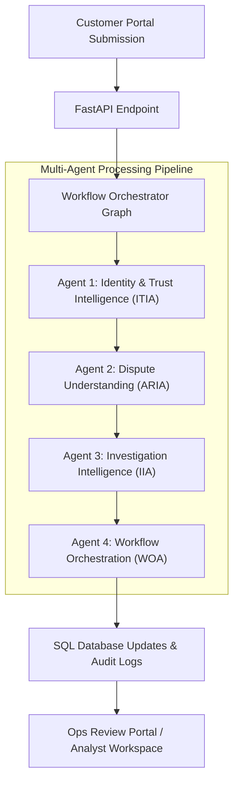

# Intelligent Transaction Dispute Resolution Platform

An enterprise-grade, multi-agent BFSI (Banking, Financial Services, and Insurance) transaction dispute resolution platform. The platform automates transaction intake, user identity and trust profiling, dispute classification, automated evidence validation, structured investigation planning, and workflow orchestration.

Backed by **FastAPI**, **LangGraph**, **Groq (Llama 3.1)**, **PostgreSQL (SQLAlchemy)**, and a **Next.js 14 (App Router)** frontend.

---

## ── Multi-Agent Architecture Overview ──

The system comprises **4 specialized, cooperative agents** that run sequentially in a compiled LangGraph workflow to evaluate, classify, investigate, and route case resolutions. The agents execute in the following sequence:



### 1. Agent 1: Identity & Trust Intelligence Agent (ITIA)
* **Purpose**: Evaluates customer identity registries, contact records, device fingerprints, transaction locations, and prior dispute history to determine profile trust, device consistency, and friendly fraud or account takeover (ATO) risk.
* **Database-Backed Tools**:
  - `verify_kyc_match`: Validates name, email, and phone matches against core customer CIF records.
  - `evaluate_device_fingerprint`: Verifies recognized device history, location consistency, and device risk levels using historical log scans.
  - `analyze_behavioral_patterns`: Scans customer dispute volume, velocity breaches, and prior dispute resolution ratios.
* **Key Outputs**:
  - `user_trust_score` (Float `0.0` to `1.0` - higher is more trusted)
  - `behavioral_risk_score` (Float `0.0` to `1.0` - lower is safer)
  - `identity_status` (`VERIFIED` | `SUSPICIOUS` | `FAILED`)
  - `trust_reasoning` (ordered bullet points detailing validation findings)
  - `trust_summary` (AI-synthesized summary paragraph)

### 2. Agent 2: Dispute Understanding Agent (ARIA)
* **Purpose**: Analyzes the claim details and uploaded documents (extracted via OCR) to categorize the dispute, assess fraud suspicion, extract customer intent, and evaluate document corroboration.
* **Understanding Tools (in-memory computation)**:
  - `assess_transaction_context`: Evaluates transaction value, timing patterns, CNP risk, and international category factors.
  - `score_fraud_indicators`: Tallies active fraud patterns (OTP sharing, remote access, phishing links, card/device loss).
  - `verify_evidence_match`: Checks if OCR texts corroborate transaction details (merchant, amounts, and dates).
  - `compute_confidence_score`: Calculates LLM self-assessed confidence level based on input completeness and signal consistency.
* **Key Outputs**:
  - `dispute_category` (One of 9 canonical BFSI categories, e.g., `Unauthorized Transaction`, `Duplicate Transaction`, `Refund Not Received`)
  - `fraud_suspicion` (Boolean flag)
  - `priority` (`CRITICAL` | `HIGH` | `MEDIUM` | `LOW`)
  - `confidence_score` (Float `0.0` to `1.0`)
  - `risk_tags` (e.g., `VELOCITY_BREACH`, `POSSIBLE_FRAUD`, `CARD_NOT_PRESENT`)
  - `evidence_match` (Boolean verdict indicating if uploaded documents support claim details)

### 3. Agent 3: Investigation Intelligence Agent (IIA)
* **Purpose**: Pre-runs database-backed historical intelligence checks on the customer, merchant, and duplicate cases, then designs a structured investigation plan tailored to the category and risk signals.
* **Database-Backed Tools**:
  - `lookup_customer_history`: Examines historical dispute volume, chargeback ratios, and frequency trends.
  - `check_merchant_risk`: Resolves merchant category risk profiles, chargeback ratios, and complaints.
  - `find_duplicate_transaction`: Audits active disputes for identical merchant/amount/date overlaps within a 72-hour window.
  - `lookup_related_cases`: Resolves historical case outcomes for similar dispute types.
* **Key Outputs**:
  - `recommended_queue` (`CRITICAL_QUEUE` | `FRAUD_QUEUE` | `HIGH_VALUE_QUEUE` | `MERCHANT_QUEUE` | `ATM_QUEUE` | `STANDARD_QUEUE`)
  - `investigation_complexity` (`LOW` | `MEDIUM` | `HIGH` | `CRITICAL`)
  - `required_documents` (list of outstanding evidence to request from customer/bank)
  - `recommended_steps` (ordered resolution plan checklist for ops analysts)
  - `investigation_summary` (comprehensive plan outline)

### 4. Agent 4: Workflow Orchestration Agent (WOA)
* **Purpose**: Designs the execution path for downstream specialist execution, coordinates escalation plans, and estimates operational workloads/analyst requirements.
* **Orchestration Tools**:
  - `evaluate_case_complexity`: Computes routing complexity based on transaction value, risk tags, and Agent 3 results.
  - `determine_required_agents`: Evaluates which specialist nodes (Fraud, Merchant, Evidence, Compliance) must run.
  - `recommend_workflow_path`: Maps sequence for specialist agents.
  - `assess_escalation_need`: Determines if human escalations or supervisor approvals are required.
  - `estimate_workload`: Recommends analyst levels (`LEAD` | `SENIOR` | `STANDARD` | `JUNIOR`) and hours required.
* **Key Outputs**:
  - `workflow_complexity` (`LOW` | `MEDIUM` | `HIGH` | `CRITICAL`)
  - `required_agents` (e.g., `["FRAUD_AGENT", "COMPLIANCE_AGENT"]`)
  - `workflow_path` (execution sequence, e.g., `["FRAUD_AGENT", "COMPLIANCE_AGENT"]`)
  - `next_agent` (immediate next specialist node to execute)
  - `escalation_required` (Boolean)
  - `analyst_level` (`LEAD` | `SENIOR` | `STANDARD` | `JUNIOR`)
  - `estimated_investigation_hours` (integer)

---

## ── Technical Stack ──

### Backend (Python 3.11)
* **Framework**: FastAPI
* **Orchestration**: LangGraph, LangChain
* **LLM Engine**: ChatGroq (Llama-3.1-8B-Instant)
* **Database & ORM**: PostgreSQL, SQLAlchemy
* **Document Extraction**: pdfplumber, PyMuPDF, pytesseract (OCR)
* **Resilience**: Tenacity (Exponential backoff retries for LLM rate limits)

### Frontend (Next.js 14)
* **Framework**: React 18 & TypeScript
* **Form Management**: React Hook Form, Zod
* **Styling**: Vanilla CSS Design Tokens (for layouts, cards, grids) & Tailwind CSS
* **Icons**: Lucide React

---

## ── Local Development Setup ──

All backend configurations and database secrets are loaded dynamically from environment variables.

### 1. Database Migrations & Seeding
1. **Activate Python Virtual Environment**:
   ```bash
   cd backend
   python -m venv venv
   # Windows:
   .\venv\Scripts\activate
   # macOS/Linux:
   source venv/bin/activate
   
   pip install -r requirements.txt
   ```

2. **Initialize Database Columns**:
   Runs the database tables creation and applies schemas:
   ```bash
   python -c "from database.database import init_db; init_db()"
   ```

3. **Seed Customer & Transaction Registries**:
   Populates customer details, transaction history, merchants, and prior logs:
   ```bash
   python scripts/seed_postgresql_fixed.py
   ```

4. **Seed Active Ops Cases**:
   Populates active case workflows, workflow plans, audit logs, and trust intelligence cards on the internal review dashboard:
   ```bash
   python scripts/seed_dispute_cases.py
   ```

### 2. Running the Backend Server
```bash
# From the backend/ directory
uvicorn api.main:app --reload
```
* **Base URL**: [http://localhost:8000](http://localhost:8000)
* **API Swagger Documentation**: [http://localhost:8000/docs](http://localhost:8000/docs)

### 3. Running the Frontend Server
```bash
# From the frontend/ directory
npm install
npm run dev
```
* **Base URL**: [http://localhost:3000](http://localhost:3000)

---

## ── Portal Routing & Interaction ──

* **Dispute Submission Portal**: [http://localhost:3000/submit-dispute](http://localhost:3000/submit-dispute)
  - Auto-fill Customer Registry: Enter **`CUST-00001`** in the Customer ID input.
  - Auto-fill Transaction Details: Enter **`TXN-00000001`** in the Transaction ID input.
* **Ops Review Queue Dashboard**: [http://localhost:3000/internal-review](http://localhost:3000/internal-review)
  - Displays seeded cases, triage queue groupings, and status filters.
  - Click on any case (e.g., `CASE-000001`) to open the workspace.
  - Click the **Trust Intelligence** tab (second tab) to review KYC validations, geographic transaction locations, recognized device history, and prior dispute frequency profiles.
