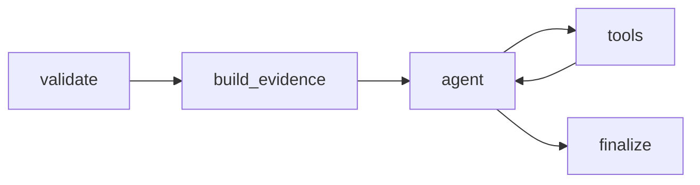

# Agent 2: Dispute Understanding Agent (ARIA)

The **Dispute Understanding Agent (ARIA)** analyzes raw dispute submissions, customer comments, and OCR-extracted document evidence. It runs as the second step in the multi-agent pipeline to categorize disputes, flag potential fraud indicators, prioritize cases, and verify document matches.

---

## ── Metadata & Configuration ──

* **Full Name**: Automated Resolution Intelligence Agent (ARIA)
* **Code Registry**: [dispute_agent](file:///d:/Transaction_dispute_agent/ai-dispute-resolution-system/backend/agents/dispute_agent)
* **Domain**: BFSI (Banking, Financial Services, and Insurance)
* **Framework**: LangGraph (StateGraph)
* **LLM Engine**: ChatGroq (Llama-3.1-8B-Instant, Temperature 0)

---

## ── Agent Persona ──

* **Role**: Senior AI Dispute Analyst.
* **Goal**: Classify every inbound dispute into exactly one of 9 canonical categories, assess fraud suspicion, assign a priority level, generate risk tags, compute a confidence score, and return a structured JSON case record.
* **Backstory**: Designed to eliminate inconsistent manual triage and accelerate fraud detection by tracing decisions and formatting them into audit-trail-friendly structures.
* **Constraints**:
  - Rely strictly on factual analysis; do not provide legal or financial advice.
  - Never fabricate transaction details not present in the input.
  - Express uncertainty numerically using a confidence score; never suppress it.
  - Return ONLY valid, parseable JSON with no conversational prose.

---

## ── LangGraph Pipeline Flow ──

ARIA is assembled as an agent-tools loop (ReAct pattern) preceded by context-building nodes:

1. **`validate` Node**: Pulls the Case ID and ensures the presence of mandatory input fields.
2. **`build_evidence` Node**: Formats the fraud checklist, constructs the OCR document block, and builds the initial message payloads.
3. **`agent` Node**: Invokes ChatGroq, which autonomously decides to call tools or output findings.
4. **`tools` Node**: Executes helper tools (defined below) if the LLM requests them.
5. **`finalize` Node**: Parses and normalizes the JSON output, adding execution times and fallback-mode indicators.

---

## ── State Schema ──

The agent maintains state via `DisputeAgentState` defined in [state.py](file:///d:/Transaction_dispute_agent/ai-dispute-resolution-system/backend/agents/dispute_agent/state.py):

* `messages`: Annotated list accumulating chat and tool call history.
* `dispute_input`: Dictionary of raw case submission details.
* `document_texts`: List of string payloads extracted from PDF or image uploads.
* `case_id`: Current Case ID.
* `supporting_evidence`: Formatted checklist of fraud indicators.
* `document_section`: Pre-formatted OCR block text provided in the prompt.
* `final_case`: Synthesized case output structure.
* `error`: Optional string tracking error details.
* `tools_used`: List tracking executed tool names.
* `agent_metadata`: Dictionary tracking agent metadata.
* `metrics`: Invocation duration, retries, and LLM call counts.

---

## ── Understanding Tools ──

Tools execute calculations in-memory without making direct DB queries, preventing classification decisions from being influenced by historical bias:

### 1. `assess_transaction_context`
* **Purpose**: Evaluates transaction risk profiles based on amount tiers, timing anomalies, card-not-present (CNP) status, and international merchant categories.
* **Inputs**:
  - `amount` (float)
  - `transaction_type` (string)
  - `merchant` (string)
  - `transaction_date` (string)
  - `transaction_time` (string)
* **Output**: Detailed transaction risk report.

### 2. `score_fraud_indicators`
* **Purpose**: Evaluates comment keywords and metadata signals to calculate a fraud signal level (e.g. OTP sharing, phishing, card blocking).
* **Inputs**:
  - `customer_comment` (string)
  - metadata flags (e.g., `otp_received`, `otp_shared`, `bank_impersonation`, `remote_access`, `phishing_link`, `sim_swap_suspected`, `card_lost`, `device_lost`, `bank_contacted`, `card_blocked`)
* **Output**: Fraud signal level verdict (`NONE` | `LOW` | `MEDIUM` | `HIGH` | `CRITICAL`) and matched risk indicators.

### 3. `verify_evidence_match`
* **Purpose**: Analyzes whether the extracted OCR document text corroborates the customer's claim.
* **Inputs**:
  - `document_text` (string)
  - `claimed_amount` (float)
  - `claimed_merchant` (string)
  - `dispute_description` (string)
* **Output**: Evidence matching verdict (`MATCH` | `PARTIAL_MATCH` | `MISMATCH` | `NO_DOCUMENTS`) and rationale.

### 4. `compute_confidence_score`
* **Purpose**: Computes an overall confidence score for the classification by weighing completeness, signal consistency, and document corroboration.
* **Inputs**:
  - `fields_complete` (boolean)
  - `comment_quality` (boolean)
  - `fraud_signal_level` (string)
  - `fraud_category_consistent` (boolean)
  - `evidence_verdict` (string)
  - `has_contradictions` (boolean)
* **Output**: Final confidence score (ranging from `0.10` to `1.00`).

---

## ── Canonical Categories & Priorities ──

### Dispute Categories
* `Unauthorized Transaction`
* `Duplicate Transaction`
* `Refund Not Received`
* `Product Not Received`
* `Subscription Abuse`
* `ATM Cash Issue`
* `Merchant Dispute`
* `Friendly Fraud`
* `Other`

### Priority Matrix
* **CRITICAL**: Suspicious transactions exceeding `50,000 INR` or showcasing identity theft indicators.
* **HIGH**: Suspicious transactions or values exceeding `50,000 INR` or multiple risk tags.
* **MEDIUM**: Standard claims, amounts between `10,000` and `50,000 INR`, or merchant dispute types.
* **LOW**: Low value or standard merchant complaints.

---

## ── Invocation ──

* **Function**: `run_dispute_agent(dispute_input: dict, document_texts: List[str], case_id: str) -> dict`
* **Module**: [__init__.py](file:///d:/Transaction_dispute_agent/ai-dispute-resolution-system/backend/agents/dispute_agent/__init__.py)
* **Callers**: Called inside the `dispute_understanding_node` in `dispute_workflow.py`, or directly from ops re-analysis endpoints in `ops_cases.py`.
