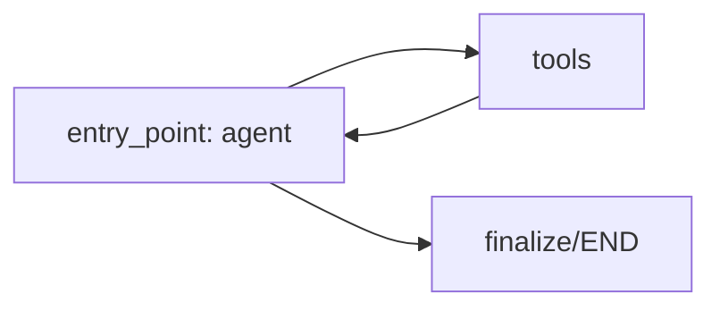

# Agent 3: Investigation Intelligence Agent (IIA)

The **Investigation Intelligence Agent (IIA)** pre-runs database-backed historical checks and synthesizes a structured investigation plan tailored to the dispute category, risk indicators, and customer history. It runs as the third step in the multi-agent pipeline, bridging the gap between classification (Agent 2) and orchestration (Agent 4) to compile diagnostic checklist resources for human operations analysts.

---

## ── Metadata & Configuration ──

* **Full Name**: Investigation Intelligence Agent (IIA)
* **Code Registry**: [investigation_agent](file:///d:/Transaction_dispute_agent/ai-dispute-resolution-system/backend/agents/investigation_agent)
* **Domain**: BFSI (Banking, Financial Services, and Insurance)
* **Framework**: LangGraph (StateGraph)
* **LLM Engine**: ChatGroq (Llama-3.1-8B-Instant, Temperature 0)

---

## ── Agent Persona ──

* **Role**: Senior AI Investigation Planner.
* **Goal**: Gather investigative intelligence on classified disputes by invoking relevant tools, synthesizing findings into a structured plan, recommending queue assignments, and flagging manual review requirements.
* **Backstory**: Designed to answer questions the customer's initial claim does not—such as customer risk history, merchant complaints, overlapping claims, and historical outcomes—ensuring analysts receive a comprehensive plan rather than a simple label.
* **Constraints**:
  - Never override or reclassify Agent 2's `dispute_category`.
  - Never give legal or financial advice.
  - If a tool fails, note the failure and continue the investigation.
  - Express plan uncertainty numerically using a confidence score.
  - Return ONLY valid, parseable JSON with no conversational prose.

---

## ── LangGraph Pipeline Flow ──

IIA executes an autonomous ReAct loop to call tools based on findings, building up its state iteratively:

1. **`agent` Node**: Examines state messages, checks classification data, and decides which lookup tools to call next.
2. **`tools` Node**: Executes database-backed queries for customer risk, merchants, duplicates, or related cases.
3. **`finalize` (Implicit in final agent step)**: Extracts structured JSON plan, mapping tool decisions and remaining intelligence gaps before exiting.

---

## ── State Schema ──

The agent maintains state through `InvestigationAgentState` defined in [state.py](file:///d:/Transaction_dispute_agent/ai-dispute-resolution-system/backend/agents/investigation_agent/state.py):

* `messages`: Annotated list accumulating chat and tool call history.
* `agent1_output`: Structured classification output (reads from Case DB).
* `tool_results`: Dictionary mapping raw database records returned by tools.
* `investigation_findings`: Intermediate findings dictionary built during execution.
* `final_output`: Synthesized investigation plan JSON payload.
* `error`: Optional string tracking error details.
* `tools_used`: List tracking executed tool names.
* `agent_metadata`: Dictionary tracking agent metadata.
* `metrics`: Invocation duration, retries, and LLM call counts.

---

## ── Database-Backed Tools ──

All tools are located in [tools.py](file:///d:/Transaction_dispute_agent/ai-dispute-resolution-system/backend/agents/investigation_agent/tools.py):

### 1. `lookup_customer_history`
* **Purpose**: Queries dispute cases to count previous disputes, assess customer risk levels, and determine historical dispute ratios.
* **Inputs**:
  - `customer_id` (string)
* **Output**: Customer risk profiles and chargeback logs (active case is excluded server-side).

### 2. `check_merchant_risk`
* **Purpose**: Resolves merchant category risk profiles, chargeback ratios, complaint history, and blacklist status.
* **Inputs**:
  - `merchant_name` (string)
* **Output**: Merchant risk profiles and dispute statistics.

### 3. `find_duplicate_transaction`
* **Purpose**: Detects duplicate or overlapping disputes submitted by the same customer (matching transaction ID or customer/merchant/amount within 72 hours).
* **Inputs**:
  - `transaction_id` (string)
  - `customer_id` (string)
  - `amount` (float)
  - `merchant` (string)
* **Output**: Overlapping duplicate indicators and linked case IDs.

### 4. `lookup_related_cases`
* **Purpose**: Fetches resolution outcomes and statistics for historical cases matching the same dispute category and merchant.
* **Inputs**:
  - `dispute_category` (string)
  - `merchant` (string, optional)
* **Output**: Related case resolution statistics.

---

## ── Operational Queue Routing ──

IIA assigns cases to queue categories using values and risk findings:
* **`CRITICAL_QUEUE`**: Fraud suspicion is true and amount exceeds `50,000 INR`, or identity status is failed/suspicious.
* **`FRAUD_QUEUE`**: Fraud suspicion is true but below critical thresholds.
* **`HIGH_VALUE_QUEUE`**: Transaction amount exceeds `50,000 INR` with no fraud suspicion.
* **`MERCHANT_QUEUE`**: Claims involving subscription abuse, product or refund disputes.
* **`ATM_QUEUE`**: Claims involving ATM cash dispenser failures.
* **`STANDARD_QUEUE`**: Low-risk/low-value standard disputes.

---

## ── Invocation ──

* **Function**: `run_investigation_agent(agent1_output: dict) -> dict`
* **Module**: [__init__.py](file:///d:/Transaction_dispute_agent/ai-dispute-resolution-system/backend/agents/investigation_agent/__init__.py)
* **Callers**: Called inside the `investigation_node` in `dispute_workflow.py`, or directly from ops re-investigate API endpoints in `ops_cases.py`.
