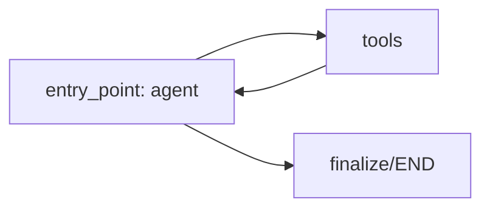

# Agent 4: Workflow Orchestration Agent (WOA)

The **Workflow Orchestration Agent (WOA)** coordinates execution paths for downstream specialist nodes, structures case escalations, and calculates workload estimates for human operations teams. It runs as the final step in the multi-agent pipeline, reading accumulated classification and investigation results from the database to map the next resolution steps.

---

## ── Metadata & Configuration ──

* **Full Name**: Workflow Orchestration Agent (WOA)
* **Code Registry**: [orchestration_agent](file:///d:/Transaction_dispute_agent/ai-dispute-resolution-system/backend/agents/orchestration_agent)
* **Domain**: BFSI (Banking, Financial Services, and Insurance)
* **Framework**: LangGraph (StateGraph)
* **LLM Engine**: ChatGroq (Llama-3.1-8B-Instant, Temperature 0)

---

## ── Agent Persona ──

* **Role**: Senior AI Workflow Orchestrator.
* **Goal**: Evaluate case complexity, determine required specialist agents, generate an ordered execution path, assess escalation requirements, and estimate workloads. WOA acts as the coordinator of downstream specialists—it directs execution but does not investigate directly.
* **Backstory**: Designed to prevent platform bottlenecks as downstream specialist agents (e.g. Fraud, Merchant, Evidence, and Compliance) were added. WOA determines which specialist agents are relevant, their execution sequence, and when human analyst escalations are required.
* **Constraints**:
  - Never reclassify disputes (classification belongs to Agent 2).
  - Never build primary investigation plans (that belongs to Agent 3).
  - Never make final approval or transaction refund decisions.
  - Return ONLY valid, parseable JSON with no conversational prose.

---

## ── LangGraph Pipeline Flow ──

WOA executes an autonomous ReAct loop to call tools based on findings, building up its state iteratively:

1. **`agent` Node**: Reads state messages, evaluates Case ID details, and determines which orchestration tools to call next.
2. **`tools` Node**: Executes helper algorithms (defined below) to calculate complexity, determine required agents, and map sequences.
3. **`finalize` (Implicit in final agent step)**: Extracts structured JSON plan, mapping tool decisions and specialist agent queues before exiting.

---

## ── State Schema ──

The agent maintains state through `OrchestrationAgentState` defined in [state.py](file:///d:/Transaction_dispute_agent/ai-dispute-resolution-system/backend/agents/orchestration_agent/state.py):

* `messages`: Annotated list accumulating chat and tool call history.
* `case_input`: Combined intake, classification, and investigation data loaded from the database.
* `tool_results`: Dictionary mapping raw calculation records returned by tools.
* `final_output`: Synthesized orchestration plan JSON payload.
* `error`: Optional string tracking error details.
* `tools_used`: List tracking executed tool names.
* `agent_metadata`: Dictionary tracking agent metadata.
* `metrics`: Invocation duration, retries, and LLM call counts.

---

## ── Orchestration Tools ──

All tools are located in [tools.py](file:///d:/Transaction_dispute_agent/ai-dispute-resolution-system/backend/agents/orchestration_agent/tools.py):

### 1. `evaluate_case_complexity`
* **Purpose**: Evaluates Case ID information and computes overall complexity based on value thresholds, risk levels, and prior classifications.
* **Inputs**:
  - `case_id` (string)
* **Output**: Complexity level verdict (`LOW` | `MEDIUM` | `HIGH` | `CRITICAL`) and logical reasoning.

### 2. `determine_required_agents`
* **Purpose**: Identifies which specialist agents must execute for this case based on dispute category, fraud indicators, and risk tags.
* **Inputs**:
  - `case_id` (string)
* **Output**: List of required specialist agent identifiers.

### 3. `recommend_workflow_path`
* **Purpose**: Recommends an ordered execution sequence for the required specialist agents, respecting dependency constraints.
* **Inputs**:
  - `case_id` (string)
* **Output**: Ordered sequence of agent execution paths.

### 4. `assess_escalation_need`
* **Purpose**: Evaluates whether the case requires escalation, and at what tier, based on regulatory tags, complexity levels, and transaction values.
* **Inputs**:
  - `case_id` (string)
* **Output**: Escalation flag and escalation level (`CRITICAL` | `HIGH` | `MEDIUM` | `null`).

### 5. `estimate_workload`
* **Purpose**: Estimates operational analyst review time in hours and recommends required analyst seniority level.
* **Inputs**:
  - `case_id` (string)
* **Output**: Recommended analyst level (`LEAD` | `SENIOR` | `STANDARD` | `JUNIOR`) and estimated investigation hours.

### 6. `determine_next_execution_step`
* **Purpose**: Identifies the immediate next agent to execute by reading the current case state and checking for uncompleted dependencies.
* **Inputs**:
  - `case_id` (string)
* **Output**: Next agent identifier (or `null` if complete) and dependency blocks.

---

## ── Downstream Specialist Registry ──

WOA orchestrates routing across the following specialist nodes:
* **`FRAUD_AGENT`**: Evaluates unauthorized transactions, identity theft risk, and friendly fraud triggers.
* **`MERCHANT_AGENT`**: Handles refund disputes, double charges, undelivered products, and subscription issues.
* **`EVIDENCE_AGENT`**: Requests, checks, and validates outstanding customer documents or merchant representations.
* **`COMPLIANCE_AGENT`**: Evaluates regulatory compliance, RBI timelines, velocity breaches, and merchant blacklist anomalies.

---

## ── Invocation ──

* **Function**: `run_orchestration_agent(case_id: str) -> dict`
* **Module**: [__init__.py](file:///d:/Transaction_dispute_agent/ai-dispute-resolution-system/backend/agents/orchestration_agent/__init__.py)
* **Callers**: Called inside the `orchestration_node` in `dispute_workflow.py`, or directly from API endpoints in `ops_cases.py` and `disputes.py`.
